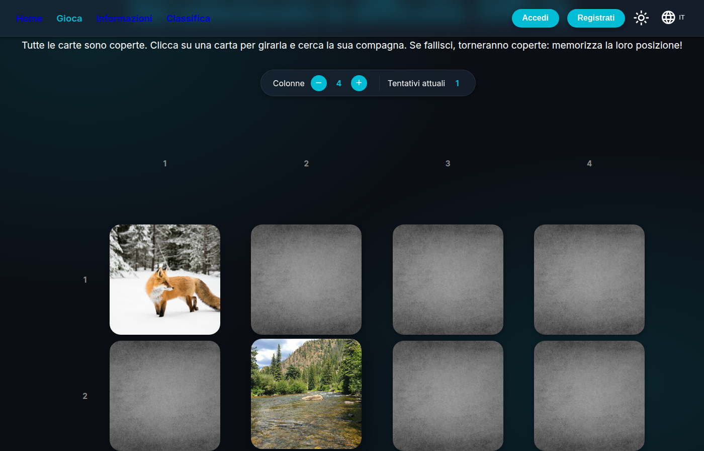
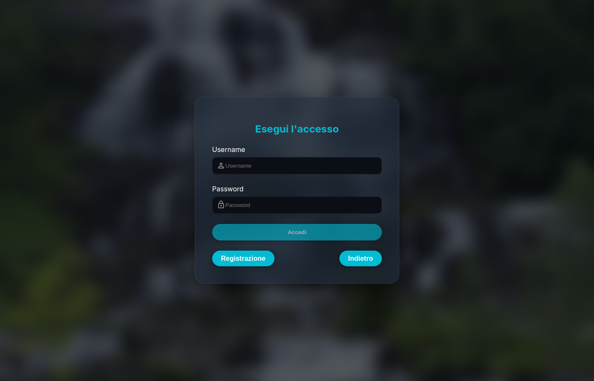
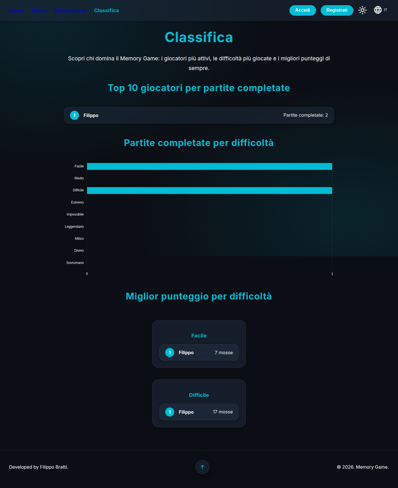

# 🧠 Memory Game

An engaging web-based memory game with user accounts, saved scores, a global leaderboard, dark/light themes and full IT/EN localization.

**[▶ Play it live](https://memorygame-xnn6.onrender.com)**

---

## 📸 Screenshots

| Home | Gameplay |
|---|---|
|  |  |

| Login | Leaderboard |
|---|---|
|  |  |

---

## 🧐 What is this project about?

I created this game for practice and to give people a fun game to play. The game works by showing a grid of hidden cards; the player must flip them to find matching pairs. As you get better, the grid gets larger and the challenge increases.

Some things it includes beyond the basic game:
* **9 difficulty levels**, from 4 up to 25 pairs of cards.
* A **custom grid layout**: you choose how many columns the board uses, with numbered rows/columns to make it easier to call out card positions to a friend.
* **Accounts & saved scores** — log in to keep track of your best games, or play as a guest.
* A **global leaderboard** — top players, games played per difficulty, and best scores per difficulty.
* **Dark and light themes**, and full **Italian/English** localization.

---

## 🛠 Technologies used

* **TypeScript & Angular** (standalone components, signals, zoneless change detection) — the frontend that runs the game in your browser.
* **C# & .NET 8** (ASP.NET Core Web API, EF Core) — the backend that handles accounts, scores and the leaderboard.
* **SQLite** — a simple file-based database for all the game data.
* **Docker** — packages the whole project (frontend + backend) into a single image.
* **Render** — hosts the live demo.

---

## 🎮 How to use the game

* **Open the link**: visit the [Live Site](https://memorygame-xnn6.onrender.com).
* **Pick a level**: choose from 9 difficulties, starting from **"Easy"**.
* **Start matching**: click a card to flip it, then try to find its match.
* **Save your score**: log in (or sign up) beforehand and your games are recorded so you can try to beat them later, and appear on the leaderboard!

---

## 💻 How to run it on your computer

### Option 1 — Docker (frontend + backend in one container)

```bash
git clone <this-repo-url>
cd MemoryGame

docker build -t memory-game .
docker run -p 10000:10000 \
  -e JwtSettings__Key="a-long-random-secret-string" \
  -e ConnectionStrings__DefaultConnection="Data Source=MemoryGame.db" \
  memory-game
```

Then open **http://localhost:10000**.

> The two `-e` variables above are required — without them the API fails to start. `JwtSettings__Key` can be any long random string (it signs login tokens); `ConnectionStrings__DefaultConnection` tells the API where to create its SQLite database file.

### Option 2 — Run frontend and backend separately (for development)

**Backend** (`MemoryGameApi/`):
```bash
cd MemoryGameApi
dotnet user-secrets set "JwtSettings:Key" "a-long-random-secret-string"
dotnet run
```
This uses `appsettings.Development.json`, which already points `ConnectionStrings:DefaultConnection` at a local SQLite file.

**Frontend** (`MemoryGameAngular/`):
```bash
cd MemoryGameAngular
npm install
npm start
```
Then open **http://localhost:4200**.

---

## 📄 License

This project is licensed under the [MIT License](LICENSE).

---

Developed by **Filippo Bratti**.
